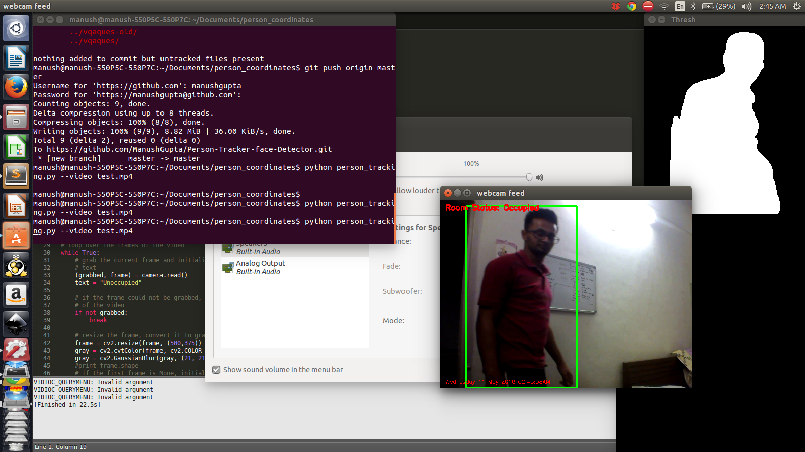

# Person-Tracker-face-Detector
Trying out OpenCV on Python to track people and detect faces. Can be used as a security feed for personal use in homes.

Started off with background subtractor on the video to get the foreground and background. Used the foreground to detect changes assuming the first frame has no people and static background is present. Applied person cascade classifier from haars cascade(but did not get satisfactory result from it , so stuck to the background subtractor) . Found an ideal value for minimum area for contour to ignore small changes not worthy enough to count as a change in the background(typically due to shadows and lighting etc)

Second part was to get top view of people's location in the room. I do not know if this part can be accurately done without a stereo camera for depth estimation of objects(and typically no webcam will have stereo cam). Nonetheless , i tried to do a perspective transform to try to get near to the solution but i couldn't receive a satisfactory result as the two planes to change perspective are almost perpendicular as a result one coordinate gets cancelled out during transformation giving only a black image. 

Environment : Python 2.7 , opencv 2.4

